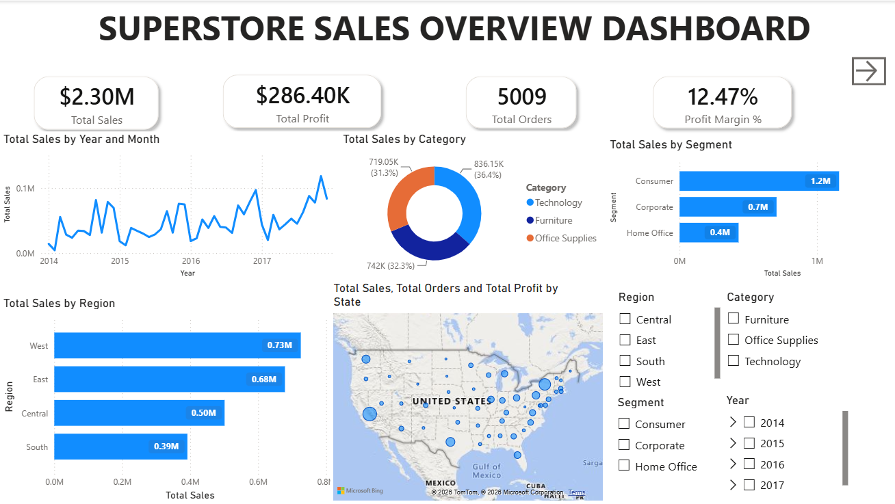
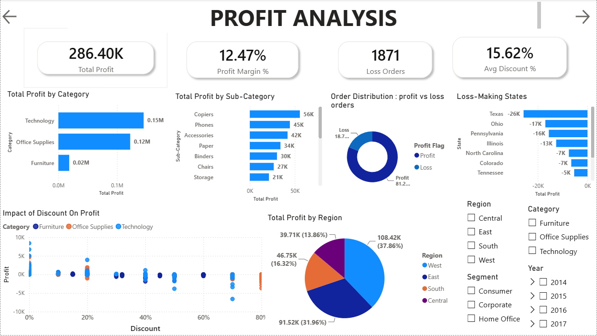
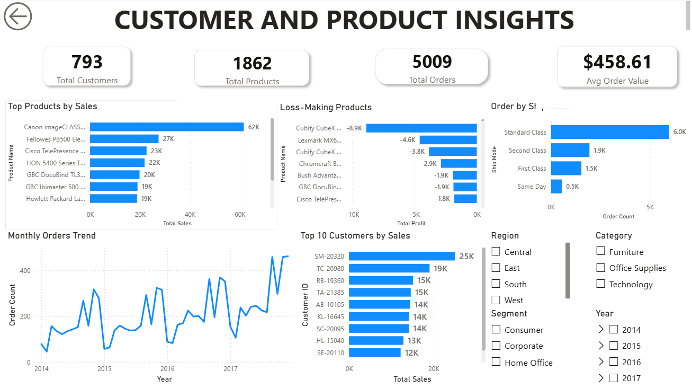

# Superstore Sales Analysis

## Project Overview

This project is an end-to-end data analytics solution built using Excel, PostgreSQL, SQL, and Power BI. The objective was to analyze retail sales data, identify business trends, and develop interactive dashboards to support data-driven decision-making.

## Objectives

* Analyze sales and profit performance.
* Identify profitable and loss-making products.
* Evaluate regional and category-wise performance.
* Understand customer purchasing trends.
* Build interactive dashboards for business insights.

## Tools & Technologies

* Microsoft Excel
* PostgreSQL
* SQL
* Power BI

## Project Workflow

1. Data Cleaning and Preprocessing using Excel.
2. Data Import and Analysis using PostgreSQL.
3. Exploratory Data Analysis using SQL queries.
4. Dashboard Development using Power BI.
5. Business Insights and Performance Analysis.

## Dashboard Preview

### Executive Overview

### Profit Analysis

### Customer & Product Analysis

## Key Insights

* Analyzed sales and profitability across categories and regions.
* Identified loss-making products and orders.
* Evaluated the impact of discounts on profitability.
* Tracked customer and product performance using interactive dashboards.

## Repository Contents

* Power BI Dashboard (.pbix)
* SQL Analysis Queries
* Dashboard Screenshots
* Project Documentation

## Author

**Gowthami M**

B.Tech Information Technology Student
Interested in Data Analytics, Business Intelligence, and Data Visualization.
